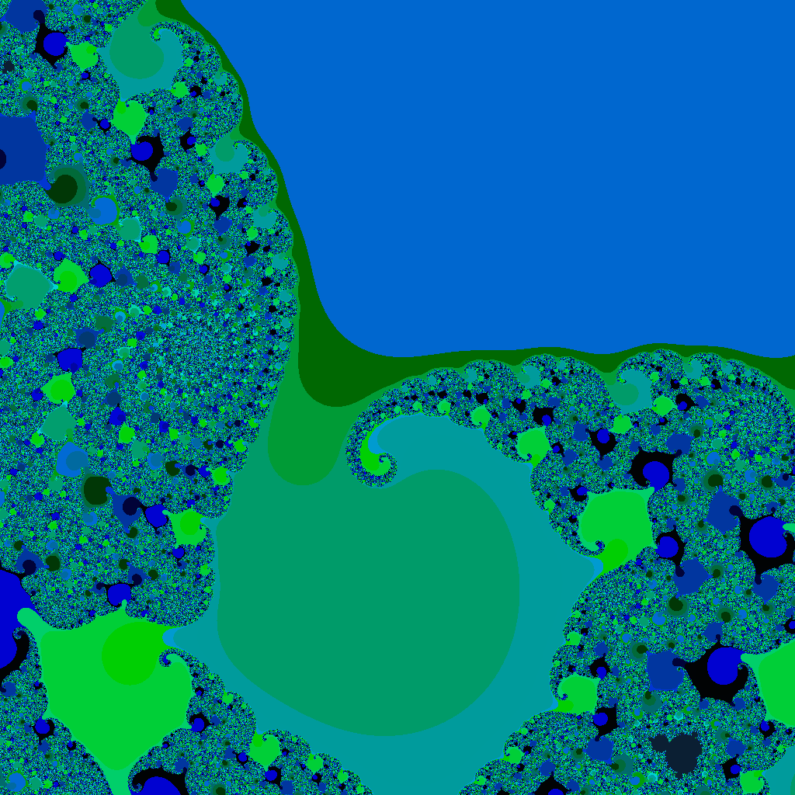

# Fractals
 Generates a Mandelbrot set and save the image into a file (.BMP or .PNG). There are two implementations, one is in C and the other is in C++. 

This program uses an escape time algorithm. For each pixel in the image, it starts with the x any y position, and then computes a recurrence relation until it exceed a fixed value or runs for max iterations. Then the pixel is assigned a color according to the number of iterations completed.